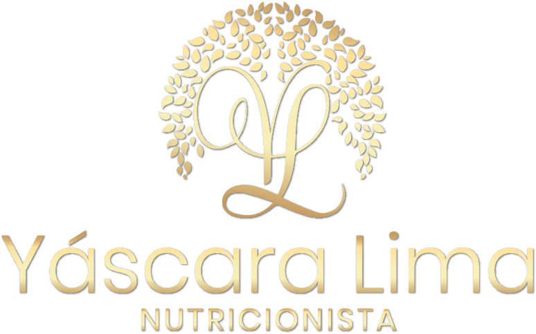

<p align="center">
  
</p>

<h1 align="center">Yáscara Lima — Website Institucional</h1>

<p align="center">
  Landing page responsiva para apresentar a atuação, os serviços e a proposta de cuidado da nutricionista Yáscara Lima.
</p>

<p align="center">
  
  
  
  
</p>

## Sobre o projeto

Este repositório contém o código-fonte do website institucional de **Yáscara Lima**, nutricionista com atendimento on-line e presencial. A experiência foi construída para comunicar uma abordagem humanizada, individual e sustentável da nutrição, com chamadas diretas para contato e agendamento.

O projeto usa apenas tecnologias nativas da web: não há framework, processo de build ou dependências de runtime. Isso mantém a página simples de executar, hospedar e manter.

## Destaques

- Layout responsivo, do celular a telas de alta resolução.
- Identidade visual própria em tons de creme, rosé, malva e dourado.
- Seções para apresentação profissional, serviços, benefícios, galeria e contato.
- Menu móvel com navegação suave e fechamento pela tecla `Esc`.
- Animações de entrada conforme o conteúdo aparece na tela.
- Marquee contínuo, parallax no hero e efeito de inclinação nos cards em dispositivos compatíveis.
- Ajustes de movimento para usuários com `prefers-reduced-motion` ativado.
- Integrações diretas com WhatsApp, Instagram e e-mail.

## Serviços apresentados

| Serviço | Proposta |
| --- | --- |
| Consultoria Nutricional | Avaliação de hábitos e orientação prática para escolhas mais conscientes. |
| Acompanhamento + Plano Alimentar | Plano individual, acompanhamento próximo e ajustes conforme a evolução. |
| Parcerias & Projetos | Colaborações com marcas, clínicas, academias e empresas. |

## Tecnologias

| Camada | Tecnologias |
| --- | --- |
| Estrutura | HTML5 semântico |
| Estilos | CSS3 modular, custom properties, Grid, Flexbox e media queries |
| Interações | JavaScript puro, Intersection Observer e `requestAnimationFrame` |
| Tipografia | Cormorant Garamond e Poppins via Google Fonts |
| Hospedagem | Compatível com qualquer serviço de hospedagem estática |

## Estrutura do repositório

```text
.
├── assets/                 # Logotipos, favicon e fotografias
├── css/
│   ├── main.css            # Ponto de entrada e importação dos estilos
│   ├── base.css            # Tokens visuais e estilos globais
│   ├── responsive.css      # Breakpoints e adaptações de layout
│   └── *.css               # Estilos organizados por seção/componente
├── js/
│   ├── mobile-menu.js      # Menu móvel e navegação entre seções
│   ├── reveal.js           # Animações de entrada no viewport
│   ├── marquee-loop.js     # Faixa de texto contínua
│   ├── card-tilt.js        # Interação tridimensional nos cards
│   ├── hero-parallax.js    # Parallax do destaque principal
│   └── protect.js          # Restrições de seleção e arraste de conteúdo
└── index.html              # Página única da aplicação
```

## Executando localmente

Clone o repositório e entre na pasta do projeto:

```bash
git clone https://github.com/ZIRTUNO/Y-scara-Nutri-Website.git
cd Y-scara-Nutri-Website
```

Como o site é totalmente estático, basta iniciar um servidor HTTP local. Com Python instalado:

```bash
python -m http.server 8000
```

Depois, acesse [http://localhost:8000](http://localhost:8000) no navegador.

Também é possível usar extensões como **Live Server** ou qualquer servidor estático equivalente.

## Personalização

| O que alterar | Arquivo principal |
| --- | --- |
| Textos, links e conteúdo das seções | `index.html` |
| Cores, tipografia e tokens globais | `css/base.css` |
| Layout e espaçamentos gerais | `css/layout.css` |
| Comportamento em diferentes telas | `css/responsive.css` |
| Animações e interações | `css/animations.css` e `js/` |
| Fotografias e identidade visual | `assets/` |

## Publicação

O projeto pode ser publicado diretamente na Vercel, Netlify, GitHub Pages ou em qualquer servidor de arquivos estáticos. Não são necessárias variáveis de ambiente nem comandos de build: a raiz do repositório já é o diretório público da aplicação.

## Autoria

Desenvolvido por [Pedro Mautone (@Pedrowtst)](https://github.com/Pedrowtst) e publicado pela [ZIRTUNO](https://github.com/ZIRTUNO).

## Uso da marca e das imagens

Este repositório não possui uma licença open source declarada. A identidade visual, a marca e as fotografias presentes em `assets/` não estão automaticamente autorizadas para reutilização, modificação ou distribuição.
